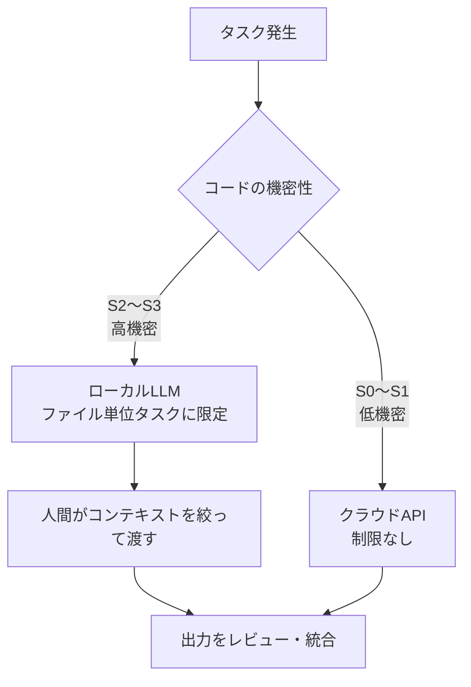

# ソブリンAI検証戦略

## 背景と動機

「社内の機密コードを外部APIに送りたくない」という要件は、クラウドLLMの業務活用における最大の障壁の一つである。コード補完・バグ修正・リファクタリングといったタスクにLLMを活用したい一方、ビジネスロジックやアルゴリズムを外部サーバーに送信することへの抵抗感は根強い。

ソブリンAIとは、**データの行き先・モデルの実行場所・ルーティング方針・評価基準・監査可能性の制御権を、ユーザーまたは組織の管理下に置く**アプローチである。機密コードを外部クラウドAPIに送らないことはその中核だが、「ローカルLLMだけを使うこと」が目的ではない。**クラウドLLMの代替ではなく補完**として位置づける。クラウドLLMを使えない高機密領域に対して、限定的だが安全なAI活用手段を提供することが目的である。

本ドキュメントは、sovereign-agent を活用したソブリンAIの実現可能性を段階的に検証するための戦略を定める。

**このプロジェクトの重心:**
評価レポートを作ることが目的ではない。ただし、評価なしにツール化すると安全性の担保ができない。**社内で安全に使えるソブリンAIツールを作るために、評価によって適用範囲を限定していく**ことがこのプロジェクトの位置づけである。評価で通ったタスクだけをVS Code拡張に載せ、長期的に高機密コード向けの限定Agent基盤とする。

> **本ドキュメントの位置づけ:**
> このファイルは**戦略・ロードマップ**を記述する。各フェーズの実証データ・モデル比較・詳細考察は別ファイルに分離されており、以下の関係にある。
>
> ```
> sovereign-ai.md        ←  "なぜ・何を・どう検証するか"（戦略）
>     ↑ 根拠を提供
> eval/phase0/summary.md        ←  フェーズ0実証データ（バグ修正・15モデル評価）
> eval/phase1/summary.md        ←  フェーズ1実証データ（実務タスク・docstring/テスト/型アノテーション等）
>     ↑ データを生成
> eval/phase0/run_eval.py / eval/phase1/run_eval.py  ←  評価ハーネス
> ```

---

## 現実的な制約の認識

ローカルLLMには避けられない制限がある。

| 制約 | 内容 |
|---|---|
| **コンテキスト長** | 27Bクラスでも実用的には数千〜1万トークン程度が上限 |
| **推論能力** | 複数ファイルにまたがる依存関係の把握は困難 |
| **速度** | GPUなしでは1リクエスト数十秒〜数分 |
| **モデル更新** | クラウドAPIと異なり、自分でアップデートが必要 |

「複数ファイル・大規模コードベース全体を理解した上でタスクをこなす」ことはローカルLLMには現時点で期待できない。この制約を前提に、**価値を出せる範囲を明確に定義する**ことが戦略の核心である。

---

## 運用原則

ソブリンAIは、ローカルLLMに自律的に大規模変更を任せる仕組みではない。**人間がスコープを限定し、LLMは限定された範囲で補助作業を行う**。

1. **機密コードは外部APIへ送信しない** — S2以上のコードはローカルLLMのみで処理する
2. **ローカルLLMには単一ファイルまたは明示的に切り出したコンテキストのみ渡す** — コードベース全体を渡さない
3. **生成結果は必ず人間がレビューする** — LLMの出力を無条件に適用しない
4. **自動適用ではなく、まずは提案・パッチ生成に限定する** — 慣れてから段階的に自動化を検討
5. **評価データに基づいて適用範囲を段階的に拡張する** — 実証なき拡張はしない

---

## 落としどころ：機密度によるルーティング

全コードをローカルLLMで処理しようとするのではなく、**機密性に応じてルーティングする**設計が現実的である。



### 機密度分類

毎回「これはローカル？クラウド？」を人間の気分で判断しないよう、分類基準を定める。

| 分類 | 例 | 推奨処理 |
|---|---|---|
| **S3: 高機密** | ビジネスロジック、顧客固有コード、独自アルゴリズム、個人情報処理 | ローカルLLMのみ |
| **S2: 社内限定** | 社内ツール、非公開設定、内部スクリプト | 原則ローカル、必要に応じて要承認 |
| **S1: 低機密** | 一般UIコード、公開API利用コード、汎用ユーティリティ | クラウドLLM可 |
| **S0: 公開情報** | README、公開サンプル、一般技術文書 | クラウドLLM可 |

### ローカルLLMが現実的に機能するタスク

| 優先 | タスク | スコープ | 備考 |
|:---:|---|---|---|
| 1 | docstring・コメント追加 | 1ファイル | 低リスクで実務価値が見えやすい |
| 2 | ユニットテスト生成 | 1〜2ファイル | 成否を自動評価しやすい |
| 3 | 単純なリファクタリング | 1ファイル | 実務に近いが制御しやすい |
| 4 | コミットメッセージ・PR説明生成 | git diff | diffベースで機密度を制御しやすい |

### 人間が担う役割

コードベース全体の理解が必要な場面では、**LLMに全体を把握させるのではなく、人間が関連箇所を切り出してコンテキストを作る**。LLMはその切り出されたスコープの中でタスクをこなす。

---

## 評価の仕組み

### 何を測っているか

sovereign-agent の eval ハーネスは、**ローカル LLM をエージェントとして実際に動かしたときの安定性**を測定する。「このコードのバグはどこか」という質問に答えさせるのではなく、モデルが CLI として起動されてファイルを操作し、実行確認し、正しく止まれるかを測る。

### 評価フロー

sovereign CLI を subprocess として一時ファイルシステムに対して起動し、`read_file → write_file → bash` のエージェントループが実際に動くかを確認する。T1（ファイル変更）・T2（実行出力の一致）・T3（exit 0 で終了）の3段階で判定し、T2 を合否ラインとする。実行コマンドと実装の詳細は [CLAUDE.md の Eval Harness セクション](../CLAUDE.md) を参照。

### stability（安定性）が核心指標である理由

同じモデル・同じタスクを **3回独立に実行**し、T2 が何回通るかを計測する。

| stability | 意味 |
|:---:|---|
| 100% | 3/3 — 本番採用できるレベル |
| 67% | 2/3 — 時々失敗する。自動適用には不向き |
| 33% | 1/3 — flaky。スコアが良くても実用外 |
| 0% | 0/3 — 毎回失敗 |

LLM の出力は確率的にゆらぐため、1回正解できても実用性の証明にならない。**再現性こそが「使えるかどうか」の判断基準**という考え方がこのハーネスの設計思想。

一般的なベンチマークとの違いは [README.md の「一般的なベンチマークとの違い」](../README.md) を参照。

### Phase 1 の判定方法（criteria-based）

`ast`・`diff`・`pytest_pass` 等の判定基準の詳細は [CLAUDE.md のフェーズ1 チェックメソッド](../CLAUDE.md) を参照。「最小介入」の確認（`diff` チェック）が必須条件に含まれており、正しい追加をしながら関数本体を変えると不合格になる。

---

## 検証ロードマップ

### フェーズ0（完了）：単一ファイル・単純バグ修正の実証

- 15モデルを対象に6種のバグ修正タスクを評価
- 2段階評価（単回 → 安定性 `--runs 3`）を実施

→ 評価結果・推薦モデルは [eval/eval_results.md](../eval/eval_results.md) を参照

### フェーズ1（完了）：実務に近いタスクでの検証

単純バグ修正ではなく、実際の業務で発生しやすいタスクを対象に評価した。
全15モデルを対象に評価を実施（フェーズ0上位に絞らず全数で比較）。

**評価タスクの結果:**

| タスク | ケース | 状態 | Tier1通過率 |
|---|---|:---:|:---:|
| docstring追加（単純） | 01 | ✅ 完了 | 5/5 T3 |
| docstring追加（複雑） | 02 | ✅ 完了 | 5/5 T2（T3はプロンプト次第）|
| docstring プロンプト実験 | 02b | ✅ 完了 | 5/5 T3（1行追記で突破）|
| ユニットテスト生成 | 03 | ✅ 完了 | 5/5 T3 |
| 型アノテーション追加 | 04 | ✅ 完了 | 5/5 T3 |
| コミットメッセージ生成 | 05 | ✅ 完了 | 12/15 T3（Tier1全stab=100%）|

→ 評価結果・推薦モデルは [eval/eval_results.md](../eval/eval_results.md) を参照

評価軸は Correctness・Minimality・Intent Alignment・Reviewability・Safety の5軸。T2（実行成功）だけでは足りず、**人間レビューで受け入れ可能か**を成功基準とする。機密コードへの誤った変更混入はセキュリティリスクと同様に扱う。

### フェーズ2（将来）：CI/CDパイプラインへの統合検討

定型タスクで品質が確認できた場合、PR作成時の自動補助として組み込む。

- コミットメッセージの自動提案
- テスト未作成の関数への警告とスタブ生成提案
- lint エラーの自動修正提案

---

## 成功基準

| フェーズ | 成功の定義 |
|---|---|
| フェーズ0 | 上位モデルが T2 ≥ 5/6、安定性 ≥ 80% ✅ 達成（詳細: [eval/phase0/summary.md](../eval/phase0/summary.md)） |
| フェーズ1 | 実務タスク4軸（Correctness・Minimality・Security・Reviewability）で合格率 ≥ 70% ✅ 達成（詳細: [eval/phase1/summary.md](../eval/phase1/summary.md)） |
| フェーズ2 | CI統合後、開発者が「有用」と評価するケース ≥ 60% |

---


## ルーティング方針

ルーティングには**2つの軸**がある。単一のモデル・単一の実行環境ですべてを処理しようとしない。

```
タスク発生
  ├─ 軸2: コードの機密度
  │    S2〜S3（機密）→ ローカルLLM（Ollama）必須
  │    S0〜S1（低機密）→ クラウドAPI可
  │
  └─ 軸1: タスク種別（ローカルLLMの場合）
       eval 実測ベースのデフォルトモデルを --task フラグで自動選択
       現在の割り当て → eval/eval_results.md を参照
```

**現在の実装状況:**
- 軸1（タスク→モデル）: VS Code拡張の `getTaskModel()` に実測ベースのデフォルト値を実装済み。タスクボタン押下時に自動切替
- 軸2（機密度→ローカル/クラウド）: 現状はユーザーが手動判断。`.sovereign-ai.yml` による自動判断は未実装

### 設計上の原則

評価を通じて得られた、モデル選択に依存しない設計上の知見：

**ベンチマーク上のコード性能より「再現性・最小介入・実行確認」が効く**

コーディング特化を標榜するモデルが、エージェントタスクでは汎用モデルに負けるケースが観測されている。詳細は [eval/eval_results.md](../eval/eval_results.md) を参照。現在の推薦モデルも同ファイルに記載している。

### このルーティング方針の留意点

軸1（タスク→モデル）は5タスク全てでフェーズ1実測を完了し、根拠が揃った。軸2（機密度→ローカル/クラウド）は設計未着手。

**軸2が未設計であることの含意**

現状は「どのコードをローカルで処理するか」をユーザーが毎回手動で判断している。機密度の誤判断（本来S3のコードをクラウドに送る）はセキュリティリスクに直結するため、軸2の自動化は軸1の最適化より優先度が高い可能性がある。

**モデル割り当ては暫定方針**

各割り当ては実測に基づく暫定値であり、新モデル追加・再評価のたびに見直す。現在の割り当ては [eval/eval_results.md](../eval/eval_results.md) を参照。

**calls 数が少ない = 効率的とは限らない**

確認ステップを省略している可能性があり、慎重さが求められる修正では少ない calls が必ずしも良いとは言えない。

**安定性 X% = (100-X)% の確率で失敗**

実務では「一見動くが意図と異なる変更が入る」という形の失敗もある。高機密コードへの適用では安定性の解釈を慎重に行う必要がある。

**モデルを使い分けることの運用コスト**

用途別にモデルを切り替えるには、ユーザーが毎回「このタスクは何用か」を判断する必要がある。`--task` フラグによる自動分類はこのコストを下げる設計だが、分類が外れた場合のフォールバックも考慮が必要。

---

## 関連ドキュメント

### ドキュメント間の関係

```
sovereign-ai.md（本ドキュメント）
│  戦略・ロードマップ・落としどころの定義
│  "なぜローカルLLMを使うか、どの範囲で使うか"
│
├─ 根拠: eval/phase0/summary.md
│    フェーズ0の実証データ。15モデルの評価結果・考察・推薦を収録。
│
├─ 根拠: eval/eval_results.md
│    P0+P1 統合サマリ。所見・ルーティング根拠・sovereign 固有の修正履歴を収録。
│    Claude が生成・更新するため、個別数値は phase0/summary.md・phase1/summary.md が一次情報。
│
├─ 根拠: eval/phase1/summary.md
│    フェーズ1の実証データ。6タスク（docstring/テスト生成/型アノテーション等）の結果を自動生成。
│
└─ 実行: eval/phase0/run_eval.py / eval/phase1/run_eval.py
     評価ハーネス本体。新しいモデル・新しいフェーズの評価はここから実行。
     フェーズ0結果は phase0/results/<model>.json → phase0/summary.md へ蓄積される。
```

### 読む順番

1. **sovereign-ai.md**（本ドキュメント）— 全体像・戦略・ルーティング方針を把握する
2. **eval/phase0/summary.md** — フェーズ0の実証データを確認し、推薦モデルの根拠を理解する
3. **eval/phase1/summary.md** — フェーズ1の実証データ（6タスク）を確認する
4. **eval/eval_results.md** — 統合所見・ルーティング根拠・sovereign 固有の修正履歴（Claude 生成の編集メモ）
5. **CLAUDE.md の Eval Harness セクション** — 評価を自分で実行・再現する方法を確認する
