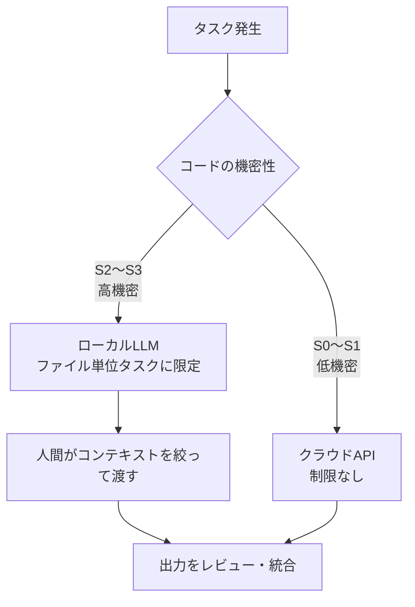

# ソブリンAI検証戦略

## 背景と動機

「社内の機密コードを外部APIに送りたくない」という要件は、クラウドLLMの業務活用における最大の障壁の一つである。コード補完・バグ修正・リファクタリングといったタスクにLLMを活用したい一方、ビジネスロジックやアルゴリズムを外部サーバーに送信することへの抵抗感は根強い。

ソブリンAIとは、**LLMの処理をオンプレミス・ローカル環境で完結させることで、外部クラウドAPIへのコード送信リスクを原理的に排除する**アプローチである。ただし、**クラウドLLMの代替ではなく補完**として位置づける。クラウドLLMを全面的に置き換えるのではなく、クラウドLLMを使えない高機密領域に対して、限定的だが安全なAI活用手段を提供することが目的である。

本ドキュメントは、sovereign-agent を活用したソブリンAIの実現可能性を段階的に検証するための戦略を定める。

**このプロジェクトの重心:**
評価レポートを作ることが目的ではない。ただし、評価なしにツール化すると安全性の担保ができない。**社内で安全に使えるソブリンAIツールを作るために、評価によって適用範囲を限定していく**ことがこのプロジェクトの位置づけである。評価で通ったタスクだけをVS Code拡張に載せ、長期的に高機密コード向けの限定Agent基盤とする。

> **本ドキュメントの位置づけ:**
> このファイルは**戦略・ロードマップ**を記述する。各フェーズの実証データ・モデル比較・詳細考察は [eval/summary.md](../eval/summary.md) に分離されており、両者は以下の関係にある。
>
> ```
> sovereign-ai.md   ←  "なぜ・何を・どう検証するか"（戦略）
>     ↑ 根拠を提供
> eval/summary.md   ←  "どのモデルが・どの程度・どれだけ安定して動くか"（実証）
>     ↑ データを生成
> eval/run_eval.py  ←  評価ハーネス（実行スクリプト）
> ```

---

## 現実的な制約の認識

ローカルLLMには避けられない制限がある。

| 制約 | 内容 |
|---|---|
| **コンテキスト長** | 27Bクラスでも実用的には数千〜1万トークン程度が上限 |
| **推論能力** | 複数ファイルにまたがる依存関係の把握は困難 |
| **速度** | GPUなしでは1リクエスト数十秒〜数分 |
| **モデル更新** | クラウドAPIと異なり、自分でアップデートが必要 |

「複数ファイル・大規模コードベース全体を理解した上でタスクをこなす」ことはローカルLLMには現時点で期待できない。この制約を前提に、**価値を出せる範囲を明確に定義する**ことが戦略の核心である。

---

## 運用原則

ソブリンAIは、ローカルLLMに自律的に大規模変更を任せる仕組みではない。**人間がスコープを限定し、LLMは限定された範囲で補助作業を行う**。

1. **機密コードは外部APIへ送信しない** — S2以上のコードはローカルLLMのみで処理する
2. **ローカルLLMには単一ファイルまたは明示的に切り出したコンテキストのみ渡す** — コードベース全体を渡さない
3. **生成結果は必ず人間がレビューする** — LLMの出力を無条件に適用しない
4. **自動適用ではなく、まずは提案・パッチ生成に限定する** — 慣れてから段階的に自動化を検討
5. **評価データに基づいて適用範囲を段階的に拡張する** — 実証なき拡張はしない

---

## 落としどころ：機密度によるルーティング

全コードをローカルLLMで処理しようとするのではなく、**機密性に応じてルーティングする**設計が現実的である。



### 機密度分類

毎回「これはローカル？クラウド？」を人間の気分で判断しないよう、分類基準を定める。

| 分類 | 例 | 推奨処理 |
|---|---|---|
| **S3: 高機密** | ビジネスロジック、顧客固有コード、独自アルゴリズム、個人情報処理 | ローカルLLMのみ |
| **S2: 社内限定** | 社内ツール、非公開設定、内部スクリプト | 原則ローカル、必要に応じて要承認 |
| **S1: 低機密** | 一般UIコード、公開API利用コード、汎用ユーティリティ | クラウドLLM可 |
| **S0: 公開情報** | README、公開サンプル、一般技術文書 | クラウドLLM可 |

### ローカルLLMが現実的に機能するタスク

| 優先 | タスク | スコープ | 備考 |
|:---:|---|---|---|
| 1 | docstring・コメント追加 | 1ファイル | 低リスクで実務価値が見えやすい |
| 2 | ユニットテスト生成 | 1〜2ファイル | 成否を自動評価しやすい |
| 3 | 単純なリファクタリング | 1ファイル | 実務に近いが制御しやすい |
| 4 | コミットメッセージ・PR説明生成 | git diff | diffベースで機密度を制御しやすい |

### 人間が担う役割

コードベース全体の理解が必要な場面では、**LLMに全体を把握させるのではなく、人間が関連箇所を切り出してコンテキストを作る**。LLMはその切り出されたスコープの中でタスクをこなす。

---

## 検証ロードマップ

### フェーズ0（完了）：単一ファイル・単純バグ修正の実証

- 15モデルを対象に6種のバグ修正タスクを評価
- 2段階評価（単回 → 安定性 `--runs 3`）を実施
- **結果**: `gemma3:27b`・`qwen3:14b` が実用レベルと判定

→ 詳細は [eval/summary.md](../eval/summary.md) を参照

### フェーズ1（完了）：実務に近いタスクでの検証

単純バグ修正ではなく、実際の業務で発生しやすいタスクを対象に評価した。
全15モデルを対象に評価を実施（フェーズ0上位に絞らず全数で比較）。

**評価タスクの結果:**

| タスク | ケース | 状態 | Tier1通過率 |
|---|---|:---:|:---:|
| docstring追加（単純） | 01 | ✅ 完了 | 5/5 T3 |
| docstring追加（複雑） | 02 | ✅ 完了 | 5/5 T2（T3はプロンプト次第）|
| docstring プロンプト実験 | 02b | ✅ 完了 | 5/5 T3（1行追記で突破）|
| ユニットテスト生成 | 03 | ✅ 完了 | 5/5 T3 |
| 型アノテーション追加 | 04 | ✅ 完了 | 5/5 T3 |
| コミットメッセージ生成 | 05 | ✅ 完了 | 12/15 T3（Tier1全stab=100%）|

**フェーズ1の結論（5つの所見）:**

1. **実用モデルは5つ** — gemma3:27b / 12b / qwen3:14b / 8b / 8b-nothink がすべてのタスクで安定
2. **コスト最適はgemma3:12b** — docstring・テスト生成・型アノテーションで27bと同等。バグ修正の複雑ケースのみ27bを使う設計が最適
3. **プロンプト設計が品質を決める** — 「明示的に求めたことしか書かない」がローカルLLMの特性。プロンプトでカバレッジを指定する
4. **タスクとモデルに相性がある** — コード特化モデルはdocstringが苦手・テスト生成が得意。汎用モデルはタスク横断で安定
5. **devstral:24bはTier1不適** — プロンプト1行の変更で崩壊。本番ルーティングには不向き

→ 詳細は [eval/summary_phase1.md](../eval/summary_phase1.md) を参照

**評価軸（5軸）:**

| 評価軸 | 内容 | なぜ重要か |
|---|---|---|
| **Correctness** | 出力が機能的に正しいか | 基本要件 |
| **Minimality** | 余計な変更をしていないか | ローカルLLMは正しいが過剰な変更をしやすい |
| **Intent Alignment** | 指示の意図と合っているか | 「一見通るが意図と違う」変更の検出 |
| **Reviewability** | 人間がレビューしやすい差分か | 自動適用ではなくレビュー前提の運用のため |
| **Safety** | 機密・危険な変更をしていないか | ソブリンAIの価値は「小さく安全に作業させること」でもある |

> T2（実行成功）だけでは足りない。**人間レビューで受け入れ可能か**を成功基準にする。機密コードへの誤った自動修正混入はセキュリティリスクと同様に扱う。

**行動シーケンス評価（フェーズ1以降）:**

calls数そのものより「少ないcallsで、必要な確認を含むか」が重要。

| ステップ | 内容 | 確認ポイント |
|---|---|---|
| **Read** | 対象ファイルを読んだか | コンテキスト理解の前提 |
| **Edit** | 最小限の修正をしたか | 過剰修正の検出 |
| **Verify** | 実行確認したか | `read → edit → finish`（検証なし）を検出 |
| **Re-edit** | 失敗時に修正し直したか | エラー回復能力 |
| **Stop** | 成功後に余計な変更をせず止まったか | 過剰介入の検出 |

**ユニットテスト生成では評価軸をさらに細分化する:**

| 評価軸 | 内容 |
|---|---|
| テストが通るか | pytest等で実行可能か |
| 期待動作を検証しているか | 単に実行しているだけではないか |
| 境界値を含むか | off-by-oneなどを拾えるか |
| 既存コードを壊さないか | 余計な修正をしていないか |
| 差分がレビュー可能か | 人間が見て妥当か |

**評価ケース設計の方針:**
- 実際のコードベースから匿名化・抽象化して作成
- 正解は人間が事前に定義（expected output）
- フェーズ0の評価ハーネス（`eval/run_eval.py`）を拡張して対応

### フェーズ2（将来）：CI/CDパイプラインへの統合検討

定型タスクで品質が確認できた場合、PR作成時の自動補助として組み込む。

- コミットメッセージの自動提案
- テスト未作成の関数への警告とスタブ生成提案
- lint エラーの自動修正提案

---

## 成功基準

| フェーズ | 成功の定義 |
|---|---|
| フェーズ0 | 上位モデルが T2 ≥ 5/6、安定性 ≥ 85% ✅ 達成 |
| フェーズ1 | 実務タスク4軸（Correctness・Minimality・Security・Reviewability）で合格率 ≥ 70% ✅ 達成（Tier1モデル5種がすべてのタスクで T2 100%） |
| フェーズ2 | CI統合後、開発者が「有用」と評価するケース ≥ 60% |

---

## 現時点での推薦構成

ソブリンAIを今すぐ試みる場合の推薦構成：

| 要素 | 推薦 |
|---|---|
| **モデル（精度重視）** | `gemma3:27b`（17GB、バグ修正で安定性94%） |
| **モデル（バランス）** | `gemma3:12b`（8GB、docstringは27bと同等） |
| **モデル（軽量重視）** | `qwen3:8b`（5GB、docstring stab=100%） |
| **実行基盤** | Ollama（ローカル） |
| **インターフェース** | sovereign CLI / VS Code extension |
| **実証済みタスク** | docstring追加・ユニットテスト生成・型アノテーション追加・コミットメッセージ生成（Tier1全モデル T2以上） |
| **適用対象** | S2〜S3 の機密性が高いコード |

---

## ルーティング方針

ルーティングには**2つの軸**がある。単一のモデル・単一の実行環境ですべてを処理しようとしない。

```
タスク発生
  ├─ 軸2: コードの機密度
  │    S2〜S3（機密）→ ローカルLLM（Ollama）必須
  │    S0〜S1（低機密）→ クラウドAPI可
  │
  └─ 軸1: タスク種別（ローカルLLMの場合）
       docstring / テスト生成 / 型アノテーション → gemma3:12b
       コミットメッセージ生成                     → qwen3:8b-nothink
       バグ修正（複雑）                           → gemma3:27b
```

**現在の実装状況:**
- 軸1（タスク→モデル）: VS Code拡張の `getTaskModel()` に実測ベースのデフォルト値を実装済み。タスクボタン押下時に自動切替
- 軸2（機密度→ローカル/クラウド）: 現状はユーザーが手動判断。`.sovereign-ai.yml` による自動判断は未実装

### モデル割り当て（軸1 — フェーズ1実測値）

> フェーズ0時点の「仮説」から、フェーズ1（全5タスク）の実測値を反映して更新した。

| 用途 | 推薦モデル | 根拠 |
|---|---|---|
| バグ修正（精度重視） | `gemma3:27b` | フェーズ0実測（T2=6/6、安定性94%） |
| バグ修正（通常） | `gemma3:27b` / `qwen3:14b` | フェーズ0実測（同等スコア） |
| docstring追加 | `gemma3:12b` / `qwen3:8b` | フェーズ1実測（27bと同スコア、コスト半減） |
| ユニットテスト生成 | `qwen3:14b` / `gemma3:12b` | フェーズ1実測（case03 Tier1全モデルT3通過、汎用モデルが優位） |
| 型アノテーション追加 | `gemma3:27b` / `qwen3:14b` | フェーズ1実測（case04 Tier1全モデルT3通過） |
| 小規模リファクタリング | `gemma3:27b` | 仮説（過剰修正を抑えやすいため） |
| コミットメッセージ生成 | `qwen3:8b-nothink` | フェーズ1実測（case05 calls=2.0・stab=100%で最効率） |
| 非推奨 | `devstral:24b` / `codestral:22b` / `granite3.3:8b` / `llama3.1:8b` | フェーズ1実測（prompt1行変更で崩壊、docstringタスクで完全失敗） |

**フェーズ1（docstring・テスト生成・型アノテーション）での主要な発見:**

- `gemma3:12b` がdocstringタスクで `gemma3:27b` と完全同等 — バグ修正では27bが上位だが、docstring・テスト生成・型アノテーションは12bで代替可能
- `qwen3:8b`（5GB）がcalls=2.2・stab=100%でTier1入り — 実務タスクはモデルサイズ依存が低い
- コード特化モデル（`qwen2.5-coder:14b`・`deepseek-coder-v2:16b`）がdocstringタスクで逆に失速 — 「コードを変更しない」指示を守れず、calls増大・本体変更が発生
- `devstral:24b` がプロンプト1行追加で崩壊（docstring_added❌）— 本番ルーティング不適
- `qwen3` 系がタスク横断で安定 — ネイティブtools APIの安定性が寄与している可能性
- 型アノテーション（case04）は全Tier1モデルが T3 通過かつ calls ≤ 3.0 — 最も安定したタスク

### コード特化モデルが必ずしも勝たないという知見

フェーズ0評価で明らかになった重要な示唆：`codestral:22b` や `devstral:24b` はコーディング特化・エージェント特化を標榜しながら、安定性評価で67%（boundary_bugでは0%）という結果に終わった。

これはAgentとしての用途においては、**ベンチマーク上のコード性能より「ファイル編集・検証・最小修正・再現性」の方が効く**ことを示している。ツール呼び出しを含む反復的なAgent動作での安定性こそが、コーディングアシスタントとしての実用性を決める。

### このルーティング方針の留意点

軸1（タスク→モデル）は5タスク全てでフェーズ1実測を完了し、根拠が揃った。軸2（機密度→ローカル/クラウド）は設計未着手。

**軸2が未設計であることの含意**

現状は「どのコードをローカルで処理するか」をユーザーが毎回手動で判断している。機密度の誤判断（本来S3のコードをクラウドに送る）はセキュリティリスクに直結するため、軸2の自動化は軸1の最適化より優先度が高い可能性がある。

**根拠が出揃った割り当て（フェーズ1完了）**

全5タスクの実測が完了した。ただし各割り当ては初期実測に基づく暫定方針であり、より多くのケースや異なるコードベースでの検証を経て見直す余地がある。

**「calls=3.0で効率的」の解釈に注意**

`gemma3:27b` のツール呼び出し回数が少ないことを「効率的」と評価したが、これは別の見方もできる。確認ステップを省略している可能性があり、慎重さが求められる修正では少ないcallsが必ずしも良いとは言えない。

**94%安定性 = 6%失敗**

安定性94%は「16回に1回は壊れる」ことを意味する。フェーズ0では「壊れる」= タスク失敗だが、実務では「一見動くが意図と異なる変更が入る」という形の失敗もある。94%を実用レベルと判断するかどうかは用途とリスク許容度次第であり、高機密コードへの適用では慎重に見る必要がある。

**モデルを使い分けることの運用コスト**

用途別にモデルを切り替えるには、ユーザーが毎回「このタスクは何用か」を判断する必要がある。シンプルさを重視するなら、フェーズ1の結果が出るまでは `gemma3:27b` 一本で運用する方が現実的かもしれない。

---

## 関連ドキュメント

### ドキュメント間の関係

```
sovereign-ai.md（本ドキュメント）
│  戦略・ロードマップ・落としどころの定義
│  "なぜローカルLLMを使うか、どの範囲で使うか"
│
├─ 根拠: eval/summary.md
│    フェーズ0の実証データ。15モデルの評価結果・考察・推薦を収録。
│    sovereign-ai.md の「現時点での推薦構成」はここから導出している。
│
├─ 根拠: eval/summary_phase1.md
│    フェーズ1の実証データ。5タスク（docstring/テスト生成/型アノテーション等）の結果・所見・判断を収録。
│    モデルルーティング方針のフェーズ1実測値はここから導出している。
│
└─ 実行: eval/run_eval.py / eval/run_eval_phase1.py
     評価ハーネス本体。新しいモデル・新しいフェーズの評価はここから実行。
     フェーズ1以降の検証結果も results_<model>.json → summary.md へ蓄積される。
```

### 読む順番

1. **sovereign-ai.md**（本ドキュメント）— 全体像と戦略を把握する
2. **eval/summary.md** — フェーズ0の実証データを確認し、推薦モデルの根拠を理解する
3. **eval/summary_phase1.md** — フェーズ1の実証データ（所見・判断含む）を確認する
4. **CLAUDE.md の Eval Harness セクション** — 評価を自分で実行・再現する方法を確認する
