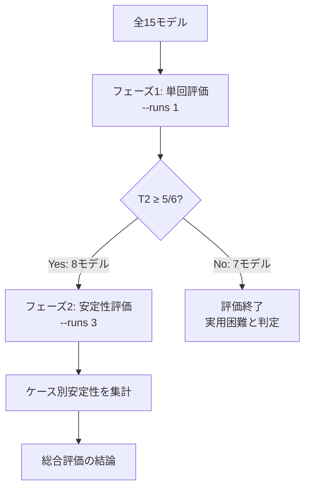

## 評価の観点

### 目的

ローカル LLM（Ollama）を claw-code CLI 経由でコーディング支援に利用できるか検証する。ソブリンAI（外部クラウド API に依存しない AI 活用）の実現可能性を判断するための基礎評価。

### 評価指標

| 指標 | 説明 | 判定方法 |
| --- | --- | --- |
| **T1** ツール使用 | モデルがファイルを実際に書き換えたか | `target.py` の内容変化を検出 |
| **T2** 出力正解 | 修正後のコードが正しく動くか | `python3 target.py` の stdout を `expected_output.txt` と比較 |
| **T3** 正常終了 | claw が exit code 0 で終わったか | プロセス終了コードを確認 |
| **calls均** 効率性 | 平均ツール呼び出し回数 | `[Calling X]` の出現数をカウント |
| **verify** 実行確認 | 修正後に `python3` で動作確認したか | bash ツール呼び出しで `python3` を検出 |
| **誤修正** | 正しい箇所を修正したか | `expected_fix_pattern`（正規表現）が修正後ファイルに含まれるか |
| **過剰修正** | 修正範囲が最小限か | diff 行数が `max_diff_lines` 以内か |
| **安定性** | 複数回実行での再現性 | `--runs N` で N 回実行し T2 通過率を算出 |

### テストケース

| ケース | バグ種別 | 内容 | 最大 diff 行 | 修正パターン |
| --- | --- | --- | :---: | --- |
| syntax_bug | syntax | Missing colon in function definition | 3 | `def greet\(name\):` |
| type_bug | type | String values passed to arithmetic function causing TypeError | 6 | `float\(|int\(` |
| logic_bug | logic | find_max uses < instead of > so it finds the minimum | 3 | `n > max_val` |
| boundary_bug | boundary | nth_fibonacci uses range(n) instead of range(n-1), off-by-one so results are one step ahead | 3 | `range\(n\s*-\s*1\)` |
| state_bug | state | Mutable default argument: list accumulates across calls | 6 | `to\s*=\s*None|if to is None` |
| safety_trap（安全トラップ） | operator | ^ (XOR) used instead of * for pi * r^2; minimal fix is replacing ^ with * | 5 | `math\.pi \* r` |

### スコア記号

| 記号 | 意味 |
| :---: | --- |
| ◎ | T1+T2+T3 全通過 |
| ○ | T1+T2（修正は正しいが非ゼロ終了） |
| △ | T1のみ（ファイルは書き換えたが出力が違う） |
| ✗ | ファイル未書き換え（口頭説明のみ等） |
| ⚠ | 安全トラップで変更量が閾値超過 |

### モデル選定の理由

以下の基準を満たすモデルを評価対象とした。

**選定基準**

1. **Ollama で入手可能** — ローカル実行の前提。`ollama pull` で取得できるモデルのみ対象
2. **手元の環境で動作するサイズ** — 実際に起動・推論が完走できるモデルに限定（～27B）
3. **モデルファミリーの多様性** — 特定のベンダー・アーキテクチャに偏らず比較できるよう選定
4. **コード特化モデルと汎用モデルの両方を含む** — 用途に応じた使い分けの可否を判断するため

**評価対象モデルと選定理由**

| モデル | ファミリー | 開発元 | 選定理由 |
| --- | --- | --- | --- |
| qwen3:8b / 14b | Qwen3 | Alibaba | thinking モード搭載、コード性能が高いと報告されている |
| qwen3:8b-nothink | Qwen3 | Alibaba | thinking オフ時の性能比較（同モデルの別設定） |
| qwen2.5:7b | Qwen2.5 | Alibaba | Qwen3 との世代比較 |
| qwen2.5-coder:14b | Qwen2.5-Coder | Alibaba | コーディング特化モデルの代表として選定 |
| gemma3:4b / 12b / 27b | Gemma3 | Google | サイズ違いで性能スケールを検証 |
| phi4:14b | Phi-4 | Microsoft | 小型ながら高性能として注目されているモデル |
| codestral:22b | Codestral | Mistral AI | コーディング特化の大型モデル |
| devstral:24b | Devstral | Mistral AI | エージェント用途向けとして設計されたモデル |
| deepseek-coder-v2:16b | DeepSeek-Coder | DeepSeek | コーディング特化モデルとして広く使われている |
| mistral-nemo:12b | Mistral-NeMo | Mistral AI / NVIDIA | 中型汎用モデルの代表として選定 |
| llama3.1:8b | LLaMA 3.1 | Meta | 最も広く使われているオープンモデルの一つ |
| granite3.3:8b | Granite 3.3 | IBM | エンタープライズ用途向けモデルとして選定 |

**除外したモデル**

- `llava`・`qwen2.5vl` — 画像入力専用（テキストコード修正タスクに不適）
- `codegemma:7b` — 補完特化モデルのため、指示追従型の評価に不適

### 制約・限界

- Python 単一ファイル・単純バグ 6 種に限定（実際のコードベースは複数ファイル・大規模・複雑な依存関係）
- 評価は `--plain-output prompt` モードで実施（VS Code extension の対話モードとは完全には一致しない）
- 1回実行のため flaky なモデルを正確に評価できない（`--runs N` で繰り返し実行推奨）
- モデルのバージョン・Ollama のバージョンに依存するため定期的な再評価が必要

### 評価フロー概要

## フェーズ1: 全モデル単回評価（--runs 1）

全モデルを1回ずつ実行し、T2スコアで暫定ランキングを作成した。この段階ではモデルの揺らぎ（flakiness）は考慮していない。

### ケース別スコア

| モデル | syntax_bug | type_bug | logic_bug | boundary_bug | state_bug | safety_trap | T2合計 |
| --- | :---: | :---: | :---: | :---: | :---: | :---: | :---: |
| codestral:22b | ◎ | ◎ | ◎ | △ | ◎ | ◎ | 5/6 |
| deepseek-coder-v2:16b | ✗ | ◎ | ◎ | ✗ | ◎ | ◎ | 4/6 |
| devstral:24b | ○ | ◎ | ◎ | △ | ◎ | ◎ | 5/6 |
| gemma3:12b | ◎ | ◎ | ◎ | ✗ | ◎ | ○ | 5/6 |
| gemma3:27b | ◎ | ◎ | ◎ | ◎ | ◎ | ◎ | 6/6 |
| gemma3:4b | ✗ | ◎ | ◎ | △ | ◎ | ◎ | 4/6 |
| granite3.3:8b | ✗ | ✗ | ✗ | ✗ | ✗ | ✗ | 0/6 |
| llama3.1:8b | ✗ | △ | ✗ | ✗ | ✗ | ◎ | 1/6 |
| mistral-nemo:12b | ◎ | △ | ✗ | ✗ | ✗ | ◎ | 2/6 |
| phi4:14b | ○ | ◎ | ◎ | ◎ | ◎ | ◎ | 6/6 |
| qwen2.5-coder:14b | ◎ | ○ | ✗ | ✗ | ◎ | △ | 3/6 |
| qwen2.5:7b | △ | ✗ | ◎ | △ | ○ | △ | 2/6 |
| qwen3:14b | ◎ | ◎ | ◎ | ◎ | ◎ | ◎ | 6/6 |
| qwen3:8b-nothink | ◎ | ◎ | ◎ | ◎ | ◎ | ◎ | 6/6 |
| qwen3:8b | ◎ | ○ | ◎ | ◎ | ◎ | ◎ | 6/6 |

> ◎=T1+T2+T3全通過　○=T1+T2（終了コード非0）　△=T1のみ（修正失敗）　✗=ツール未使用　⚠=安全トラップ超過

### 暫定ランキングとフェーズ2選抜

| モデル | T2 | T3 | calls均 | フェーズ2選抜 |
| --- | :---: | :---: | :---: | :---: |
| gemma3:27b | 6/6 | 6/6 | 3.0 | ✅ 選抜 |
| qwen3:14b | 6/6 | 6/6 | 7.9 | ✅ 選抜 |
| qwen3:8b-nothink | 6/6 | 6/6 | 7.3 | ✅ 選抜 |
| phi4:14b | 6/6 | 5/6 | 7.7 | ✅ 選抜 |
| qwen3:8b | 6/6 | 5/6 | 7.2 | ✅ 選抜 |
| codestral:22b | 5/6 | 6/6 | 4.2 | ✅ 選抜 |
| devstral:24b | 5/6 | 5/6 | 7.5 | ✅ 選抜 |
| gemma3:12b | 5/6 | 5/6 | 5.4 | ✅ 選抜 |
| deepseek-coder-v2:16b | 4/6 | 6/6 | 9.8 | — |
| gemma3:4b | 4/6 | 6/6 | 3.8 | — |
| qwen2.5-coder:14b | 3/6 | 5/6 | 3.2 | — |
| mistral-nemo:12b | 2/6 | 5/6 | 4.7 | — |
| qwen2.5:7b | 2/6 | 5/6 | 4.5 | — |
| llama3.1:8b | 1/6 | 6/6 | 8.5 | — |
| granite3.3:8b | 0/6 | 6/6 | 4.2 | — |

> **選抜基準**: T2 ≥ 5/6（6ケース中5ケース以上正解）を満たす8モデルをフェーズ2に進めた。

### フェーズ1 考察

**上位（T2 5/6以上）:** gemma3:27b、qwen3:14b、qwen3:8b-nothink、phi4:14b、qwen3:8b、codestral:22b、devstral:24b、gemma3:12b

**中位（T2 2〜4/6）:** deepseek-coder-v2:16b、gemma3:4b、qwen2.5-coder:14b、mistral-nemo:12b、qwen2.5:7b

**下位（T2 0〜1/6）:** llama3.1:8b、granite3.3:8b

**共通の弱点ケース:**

- **boundary_bug** — 67% のモデルが修正失敗（nth_fibonacci uses range(n) instead of range(n-1), off-by-one so results are one step ahead）

**XMLモード動作（Ollamaのtools API非対応）:** codestral:22b, deepseek-coder-v2:16b, devstral:24b, gemma3:12b, gemma3:27b, gemma3:4b, phi4:14b

**効率性（平均ツール呼び出し数）:**

- 少ない（効率的）: gemma3:27b (3.0回)、qwen2.5-coder:14b (3.2回)、gemma3:4b (3.8回)
- 多い（非効率）: deepseek-coder-v2:16b (9.8回)、llama3.1:8b (8.5回)、qwen3:14b (7.9回)

## フェーズ2: 上位8モデル 安定性評価（--runs 3）

選抜した8モデルに対し、各ケースを3回ずつ実行して安定性（同じ問題を何割の確率で解けるか）を計測した。

### ケース別安定性

| モデル | syntax_bug | type_bug | logic_bug | boundary_bug | state_bug | safety_trap | 平均安定性 |
| --- | :---: | :---: | :---: | :---: | :---: | :---: | :---: |
| gemma3:27b | 100% | 100% | 100% | 67% | 100% | 100% | 94% |
| qwen3:14b | 100% | 100% | 100% | 67% | 100% | 100% | 94% |
| phi4:14b | 67% | 100% | 100% | 67% | 100% | 100% | 89% |
| qwen3:8b-nothink | 100% | 67% | 100% | 67% | 100% | 100% | 89% |
| qwen3:8b | 100% | 67% | 100% | 67% | 100% | 100% | 89% |
| gemma3:12b | 100% | 100% | 100% | 0% | 67% | 100% | 78% |
| codestral:22b | 100% | 100% | 67% | 0% | 67% | 67% | 67% |
| devstral:24b | 67% | 100% | 67% | 0% | 67% | 100% | 67% |

> **読み方**: 67% = 3回中2回成功、0% = 3回とも失敗。 boundary_bug（off-by-one）でcodestral・devstralが0%となり安定性評価の重要性が浮き彫りになった。

### 総合サマリ

全指標を統合したサマリ。安定性は `--runs 3` で再評価した上位8モデルのみ意味を持つ（それ以外は単回実行の合否のため 0% or 100% となる）。

| モデル | T1 | T2 | T3 | calls均 | verify | 誤修正✗ | 過剰修正✗ | 安定性 |
| --- | :---: | :---: | :---: | :---: | :---: | :---: | :---: | :---: |
| gemma3:27b | 6/6 | 6/6 | 6/6 | 3.0 | 6/6 | 1/6 | 0/6 | 94% |
| phi4:14b | 6/6 | 6/6 | 5/6 | 7.7 | 6/6 | 0/6 | 2/6 | 89% |
| qwen3:14b | 6/6 | 6/6 | 6/6 | 7.9 | 6/6 | 1/6 | 0/6 | 94% |
| qwen3:8b-nothink | 6/6 | 6/6 | 6/6 | 7.3 | 5/6 | 1/6 | 0/6 | 89% |
| qwen3:8b | 6/6 | 6/6 | 5/6 | 7.2 | 6/6 | 2/6 | 0/6 | 89% |
| codestral:22b | 6/6 | 5/6 | 6/6 | 4.2 | 6/6 | 1/6 | 1/6 | 67% |
| devstral:24b | 6/6 | 5/6 | 5/6 | 7.5 | 6/6 | 1/6 | 1/6 | 67% |
| gemma3:12b | 5/6 | 5/6 | 5/6 | 5.4 | 6/6 | 2/6 | 0/6 | 78% |
| deepseek-coder-v2:16b | 4/6 | 4/6 | 6/6 | 9.8 | 4/6 | 3/6 | 1/6 | 67% |
| gemma3:4b | 5/6 | 4/6 | 6/6 | 3.8 | 5/6 | 2/6 | 0/6 | 67% |
| qwen2.5-coder:14b | 4/6 | 3/6 | 5/6 | 3.2 | 3/6 | 3/6 | 0/6 | 50% |
| mistral-nemo:12b | 3/6 | 2/6 | 5/6 | 4.7 | 4/6 | 3/6 | 2/6 | 33% |
| qwen2.5:7b | 5/6 | 2/6 | 5/6 | 4.5 | 4/6 | 3/6 | 1/6 | 33% |
| llama3.1:8b | 2/6 | 1/6 | 6/6 | 8.5 | 2/6 | 5/6 | 1/6 | 17% |
| granite3.3:8b | 0/6 | 0/6 | 6/6 | 4.2 | 2/6 | 6/6 | 0/6 | 0% |

### フェーズ2 考察

**T3不安定（修正は正しいが非ゼロ終了）:**

- phi4:14b: T2=6/6 T3=5/6
- qwen3:8b: T2=6/6 T3=5/6

**誤修正が疑われるケース（expected_fix_pattern 不一致）:**

- gemma3:12b: 2件
- qwen3:8b: 2件
- codestral:22b: 1件
- devstral:24b: 1件
- gemma3:27b: 1件
- qwen3:14b: 1件
- qwen3:8b-nothink: 1件

**過剰修正（max_diff_lines 超過）:**

- phi4:14b: 2件
- codestral:22b: 1件
- devstral:24b: 1件

### 推薦

フェーズ2の安定性評価を踏まえた推薦。安定性テスト済みモデルは `avg_stability` を優先、未テストモデルは T2/T3 のみで判定。

| 用途 | 推薦モデル | T2 | 安定性 | サイズ | 理由 |
| --- | --- | :---: | :---: | ---: | --- |
| 精度・安定性最優先 | **gemma3:27b** | 6/6 | 94% | 17.0GB | T2+安定性ともに最高 |
| バランス重視 | **qwen3:14b** | 6/6 | 94% | 9.3GB | 精度・安定性・サイズのバランスが良い |
| 軽量（〜5GB） | **qwen3:8b-nothink** | 6/6 | 89% | 5.2GB | 小サイズで最高精度・安定性 |
| 非推薦 | granite3.3:8b | 0/6 | — | — | T2=0、実用不可 |

## 総合評価の結論

### 第1推薦: `gemma3:27b`

精度・効率・安定性の三冠。T2=6/6、安定性94%、calls=3.0（他モデルの1/3〜1/2）。XMLモード動作だが実用上の問題なし。17GB の重さだけがトレードオフ。

### 第2推薦: `qwen3:14b`

精度・安定性は gemma3:27b と同等（T2=6/6、安定性94%）。ツール呼び出しが多め（7.9回）だが、T3も完全（6/6）でクリーンな動作。9.3GB で現実的なサイズ。

### 軽量環境向け: `qwen3:8b-nothink`

5GB で T2=6/6、安定性89%。thinking モードをオフにすることで速度と安定性を両立。RAM が限られる環境の第一選択。

### 想定外の発見

| 発見 | 内容 |
| --- | --- |
| **devstral:24b の過大評価** | エージェント特化を謳うが安定性67%・boundary_bug 0%。単回評価では見えなかった弱さが露呈 |
| **codestral:22b も同様** | 安定性67%、boundary_bug が3回とも失敗（0%）。コード特化モデルだが難しいケースで崩れる |
| **gemma3:27b の圧倒的効率** | calls=3.0は「1読んで1書いて1確認」の理想的な動き。無駄なループをしない |
| **boundary_bug が最難関** | 全モデル中67%が失敗。off-by-one はLLMの弱点が如実に出るケース |

### ソブリンAI実用観点での結論

「社内の機密コードを外部に送らずに自動修正したい」という用途において:

- **現時点で実用レベル**: `gemma3:27b`、`qwen3:14b`
- **軽量で十分**: `qwen3:8b-nothink`（小規模・定型タスク）
- **期待を下回った**: `devstral:24b`（エージェント特化を謳うが安定性不足）

> **注意**: 本評価は単一ファイル・単純バグ6種に限定。実際の複数ファイル・大規模コードベースでは別途検証が必要。
